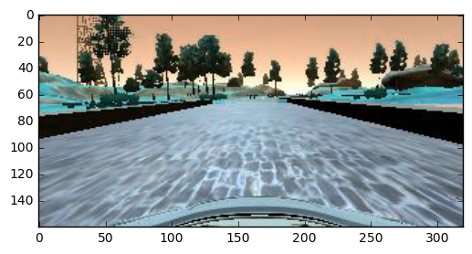
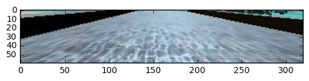
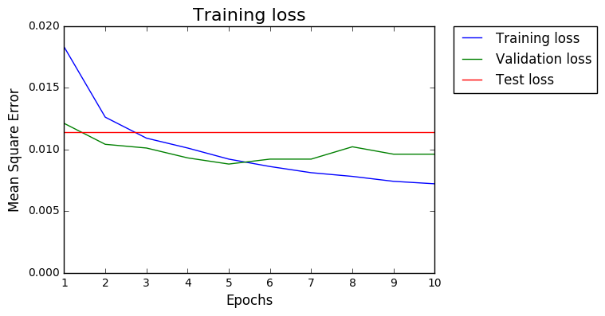

#**Behavioral Cloning** 

####By Sagar Manglani

---

**Behavioral Cloning Project**

The goals / steps of this project are the following:
* Use the simulator to collect data of good driving behavior
* Build, a convolution neural network in Keras that predicts steering angles from images
* Train and validate the model with a training and validation set
* Test that the model successfully drives around track one without leaving the road
* Summarize the results with a written report


## Rubric Points

###Here I will consider the [rubric points](https://review.udacity.com/#!/rubrics/432/view) individually and describe how I addressed each point in my implementation.  

---
###Files Submitted & Code Quality

####1. Submission includes all required files and can be used to run the simulator in autonomous mode

My project includes the following files:
* model.py containing the script to create and train the model
* drive.py for driving the car in autonomous mode
* model.h5 containing a trained convolution neural network 
* Project 3 writeup.md summarizing the results
* run2.mp4 with video of the model in action in autonomous mode

####2. Submission includes functional code
Using the Udacity provided simulator and my drive.py file, the car can be driven autonomously around the track by executing 
```sh
python drive.py model.h5
```

####3. Submission code is usable and readable

The model.py file contains the code for training and saving the convolution neural network. The file shows the pipeline I used for training and validating the model, and it contains comments to explain how the code works.

Note: The included video is of front driving recorded with video.py

###Model Architecture and Training Strategy

####1. An appropriate model architecture has been employed

For this project, I started building a model step-by-step until it was 9 layers - similar to that of Nvidia's architecture but with several differences. I started building the model from 1 layer to 9 layers including 5 convolutional and 4 fully-connected layers. More details about the model architecture are stated below.

####2. Attempts to reduce overfitting in the model

Convolutional layers have limited parameters and therefore require less regularization. Also, since the gradients here are averaged over the entire feature, it significantly reduces the effectiveness of using a dropout layer. Hence a dropout of 0.1 is used on the convolution layers. 

The neurons in the fully connected layers, however, are quite suceptible to being overtrained and, therefore, I have applied the dropout of 0.5 to each layer. 

####3. Model parameter tuning

The model used an adam optimizer and the learning rate was limited to 0.0001 instead of the default 0.001. This allowed a little slower convergence across 5 epochs. Using additional epochs worsened the model (explained at the bottom).

####4. Appropriate training data

In addition to gathering training data from different tracks, training data was also augmented by flipping each image and its measurement. This balanced the vehicle's inclination to be biased in a particular direction. Additionally, left and right images were used with a correction factor of 0.2. The correction factor enabled the vehicle to return to center in case it went to the right.


###Model Architecture and Training Strategy

####1. Solution Design Approach

The overall strategy for deriving a model architecture was to build a bottom-up model.

My first model consisted of a single dense layer that worked well on straight lines. In order to gauge how well the model was working, I split my image and steering angle data into a training and validation set. I found that my first model had a low mean squared error on the training set but a high mean squared error on the validation set. This implied that the model was overfitting.  

Then I introduced convolution layers one-by-one until I had much better accuracy at turns. I expanded the network to be comparable to Nvidia's architecture (5 convolutions and 4 fully-connected layers) to make it more responsive and able to capture a large amount of data. To combat the overfitting, I added dropouts of 0.1 in the convolution layers and 0.5 in the fully connected layers (explained above). I also reduced the learning rate in the optimizer and number of epochs in the fit (explained below). 

The final step was to run the simulator to see how well the car was driving around track one. There were a few spots where the vehicle went close to off-track. To improve the driving behavior in these cases, I recorded 5 different laps in addition to the Udacity's data, creating total of 6 datasets. Out of this, one lap was reserved for testing and not included in the training set. Out of the remaining 5 sets, 20% data (equivalent to 1 dataset) was sliced for validation set. So overall, equivalent to 4 sets of data was used to train the model.


####2. Final Model Architecture

The model uses YUV color space and consists of  convolution neural network with 3x3 and 2x2 filter sizes and depths between 24 to 64 (model.py lines 121 to end of code)  with RELU activation after each layer. Below is the image depicting my network:

| Layer/Function                           | Output Size/Type |
| ---------------------------------------- | ---------------- |
| Lambda with (30,160) input               | Normalization    |
| Convolution layer with 3x3 filter and 24 depth and 2x2 stride with RELU activation and dropout of 0.1 | (14,79,24)       |
| Convolution layer with 3x3 filter and 36 depth and 2x2 stride with RELU activation and dropout of 0.1 | (6,39,36)        |
| Convolution layer with 2x2 filter and 48 depth and 2x2 stride with RELU activation and dropout of 0.1 | (3,19,48)        |
| Convolution layer with 2x2 filter and 64 depth with RELU activation and dropout of 0.1 | (2,18,64)        |
| Convolution layer with 2x2 filter and 64 depth with RELU activation and dropout of 0.1 | (1,17,64)        |
| Flatten                                  | 1088             |
| Fully connected layer with dropout of 0.5 | 100              |
| Fully connected layer with dropout of 0.5 | 50               |
| Fully connected layer with dropout of 0.5 | 10               |
| Fully connected layer with dropout of 0.5 | 1                |


####3. Creation of the Training Set & Training Process

To capture good driving behavior, I had to record center lane driving data. By performing several runs, I selected the runs where the vehicle was driving in the center of the lane for almost the entire time. Here is an example image of center lane driving:


I then trained the vehicle to recover from the left side and right sides of the road back to center with the help of left and right images. Below is the same image as above in left and right:

Left:


Right:


The generated data's histogram is plotted below:


As seen above, the data is biased towards left. To fix this , I flipped images and combined them in the data with negative measurements. This also helps generalize the model. Below is an image that has then been flipped:

Before:


After:



After this, we re-plot the histogram distribution of the steering values and we get:


A symmetric graph is expected here since every image was flipped. This was important because driving on any side meant the left or right image data would become worse. Before feeding into the network, I cropped and resized the image. The above image is 320 by 160 pixels. By cropping 65 pixels from top and 35 from bottom, we get this picture of 320 by 60 pixels:



Now this image is then further compressed to 1/4th of its size, to 160 by 30 pixels. Below is the same image:


Upon looking closely, one can see that loss of little resolution can help the model generalize better without being inaccurate. However, the primary reason for doing this is to speed up the network training and reduce memory load. I finally randomly shuffled the data set and put 20% of the training data into a validation set. Additionally, I recorded a lap just for the testing data. By reducing the learning rate to 0.0001 in the adam optimizer, I focused on the mean square error loss observed in training and validation. Below are the stats for training for 10 epochs:


Plotting these results, we get:



At the end of 10 epochs, we get a test loss of 0.0114, which is much higher than both training and validation set. Looking at the training and validation loss, we see the optimum point to be at 5 epochs. Hence we select 5 epochs, retrain the model and get below results:


Plotting these results, we get:


Thus this result is much more desirable than any other result. The loss for the test set here is 0.0081, which is even lower than training and validation set. This is expected because training and validation sets have been fed with hard-coded correction of 0.2 in the left and right images of the vehicle. 

Finally, with this model, we record the autonomous video and get the results in run2.mp4 attached. 