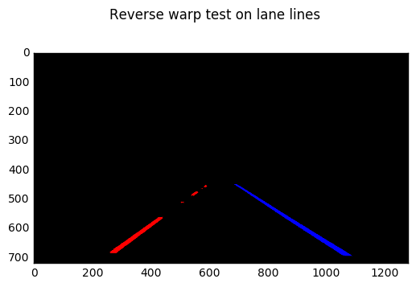

##Project 4 - Advanced Lane Lines

By Sagar Manglani

---

**Advanced Lane Finding Project**

The goals / steps of this project are the following:

* Compute the camera calibration matrix and distortion coefficients given a set of chessboard images.
* Apply a distortion correction to raw images.
* Use color transforms, gradients, etc., to create a thresholded binary image.
* Apply a perspective transform to rectify binary image ("birds-eye view").
* Detect lane pixels and fit to find the lane boundary.
* Determine the curvature of the lane and vehicle position with respect to center.
* Warp the detected lane boundaries back onto the original image.
* Output visual display of the lane boundaries and numerical estimation of lane curvature and vehicle position.


###Here I will consider the rubric points individually and describe how I addressed each point in my implementation.  

---
###Writeup / README

####1. Provide a Writeup / README that includes all the rubric points and how you addressed each one.   

You're reading it! Please note that the Jupter notebook is divided into 13 parts and I'll reference to each part in the writeup below. In notebook, each part may contain 1-3 code cells.
###Camera Calibration

####1. Briefly state how you computed the camera matrix and distortion coefficients. Provide an example of a distortion corrected calibration image.

The code for this step is contained in Part 2 of the IPython notebook located in "./Project 4 - Advanced Lane Lines.ipynb" . The code is part of function `calibrate()`. Note: I've also added html of notebook for your convenience.

For this calibration, I used all 20 images in the Camera_cal folder. I start by preparing "object points", which will be the (x, y, z) coordinates of the chessboard corners in the world. Here I am assuming the chessboard is fixed on the (x, y) plane at z=0, such that the object points are the same for each calibration image.  Thus, `objp` is just a replicated array of coordinates, and `objpoints` will be appended with a copy of it every time I successfully detect all chessboard corners in a test image.  `imgpoints` will be appended with the (x, y) pixel position of each of the corners in the image plane with each successful chessboard detection.  

I then used the output `objpoints` and `imgpoints` to compute the camera calibration and distortion coefficients using the `cv2.calibrateCamera()` function.  I applied this distortion correction to the test image using the `cv2.undistort()` function and obtained this result: 

Before calibration:


After calibration:


Notice the reduction in bulge at center. However there is still some curvature here at bottom corners.

###Pipeline (single images)

####1. Provide an example of a distortion-corrected image.
To demonstrate this step, I will apply the distortion correction to one of the test images like this one (listed in Part 4):


You can check the before correction image of straight_lines2.jpg below:


####2. Describe how (and identify where in your code) you used color transforms, gradients or other methods to create a thresholded binary image.  Provide an example of a binary image result.
I used a combination of 2 color (saturation in HLS and yellow in RGB (yellow exists in yellow and white color)) and 2 gradient thresholds (magnitude and direction) to generate a binary image listed in Part 5.  Here's an example of the all:


After this, I use following conditions to generate the final result:

1. Combine color binaries
2. Select common points among gradient thresholds
3. Combine the above 2 outputs

Below are the 3 images as described above:


####3. Describe how (and identify where in your code) you performed a perspective transform and provide an example of a transformed image.

The code for my perspective transform includes a function called `unwrap()`, in Part 2. The `unwrap()` function takes as inputs an image (`img`) and rotation matrix  (`M`) , which is calculated by function  `rotmat()`  which takes in source (`src`) and destination (`dst`) points.  I chose to hardcode the source and destination points in the following manner:

```
src = np.float32([[245,700],[597,450],[687,450],[1078,700]])
dst = np.float32([[300,720],[300,0],[980,0],[980,720]])
```
This resulted in the following source and destination points:

|  Source   | Destination |
| :-------: | :---------: |
| 245, 700  |  300, 720   |
| 597, 450  |   300, 0    |
| 687, 450  |   980, 0    |
| 1078, 700 |  980, 720   |

I verified that my perspective transform was working as expected by drawing the src lines on straight line image and its warped counterpart binary to verify that the lines appear parallel in the warped image. I also reversed it to check reverse warping was working too.





####4. Describe how (and identify where in your code) you identified lane-line pixels and fit their positions with a polynomial?

In Part 7 of the code, I use the sliding window search method on warped binary images. After finding the windows, I extract the pixel positions and then fit a second order polynomial on the same. Below is an image showing the same for the straight line 2 image.


####5. Describe how (and identify where in your code) you calculated the radius of curvature of the lane and the position of the vehicle with respect to center.

I did this in Parts 8 and 9 of the code. In part 8, I find the left and right curvature in pixels and then in part 8.5, I convert it to meters assuming 30 meters per pixel in y direction and 3.7 meters per pixel in X direction. The results are listed in output cells. I understand that 30m per pixel is an approximation and the primary reason for not-precise curvature values.

In Part 9, I use the X-pixel data corresponding to last y-pixel (719) of the polynomial function for both left and right lane. If center of image is actual center, then the offset of pixels' difference is calculated and converted to real world by assuming lane width to be 370 centimeters.


####6. Provide an example image of your result plotted back down onto the road such that the lane area is identified clearly.

Below is the output image for straight line:


---

###Pipeline (video)

####1. Provide a link to your final video output.  Your pipeline should perform reasonably well on the entire project video (wobbly lines are ok but no catastrophic failures that would cause the car to drive off the road!).

The output video is in the zip folder named "lane.mp4". Note that video uses moving average filtering based on last 5 frames. The filter is applied at polynomial coefficients.

---

###Discussion

####1. Briefly discuss any problems / issues you faced in your implementation of this project.  Where will your pipeline likely fail?  What could you do to make it more robust?

1. Accuracy: Saturation is most critical in challenging parts, so it is required to be included. But it carries lot of background noise with it. However most of this noise is eliminated in warping. Another required are the gradients. Small lane markers that are far away are easily skipped in saturation due to the fact that they are far away and of lower saturation. This is captured by color and gradients. But they introduce additional noise which is mostly filtered through histogram filter.
2. Warping and Y-distance: The warp resulted in minor curve instead of a straight line. The straight line turned up with radius of about 3-4 km. Accurate warping can improve this. Also, image distance in Y is non-linear. For example, pixel close to the car would be probably be a meter while the one far away from car would be over 50 meters. Taking a blanket assumption hurts here, specially since polynomial fit is implemented on a non-linear image. 
3. Speed: By skipping x and y direction gradient binary image calculation, the process can have comparable accuracy with lower computation, but the images have higher noise (common points remove most noise).

