##Project 5 - Vehicle Detection
######By Sagar Manglani

---

**Vehicle Detection Project**

The goals / steps of this project are the following:

* Perform a Histogram of Oriented Gradients (HOG) feature extraction on a labeled training set of images and train a classifier Linear SVM classifier
* Optionally, you can also apply a color transform and append binned color features, as well as histograms of color, to your HOG feature vector. 
* Note: for those first two steps don't forget to normalize your features and randomize a selection for training and testing.
* Implement a sliding-window technique and use your trained classifier to search for vehicles in images.
* Run your pipeline on a video stream (start with the test_video.mp4 and later implement on full project_video.mp4) and create a heat map of recurring detections frame by frame to reject outliers and follow detected vehicles.
* Estimate a bounding box for vehicles detected.

###Here I will consider the rubric points individually and describe how I addressed each point in my implementation.  

---
###Writeup / README

####1. Provide a Writeup / README that includes all the rubric points and how you addressed each one.  You can submit your writeup as markdown or pdf.   

You're reading it! Note that the code is divided into parts in the Jupyter notebook and I'll reference part number throughout the writeup.

###Histogram of Oriented Gradients (HOG)

####1. Explain how (and identify where in your code) you extracted HOG features from the training images.

The code for this step is contained in Part 5 of the IPython notebook. The actual get_hog_features function is in Part 4 of the notebook where all the primary functions are defined.

I started by reading in all the `vehicle` and `non-vehicle` images.  Here is an example of one of each of the `vehicle` and `non-vehicle` classes:

Vehicle:

Non-vehicle:

I then explored different color spaces and different `skimage.hog()` parameters (`orientations`, `pixels_per_cell`, and `cells_per_block`). Here is an example using the `YCrCb` color space and HOG parameters of `orientations=8`, `pixels_per_cell=(8, 8)` and `cells_per_block=(2, 2)`:

Image:

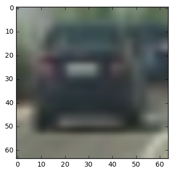

HOG on Channel 1:

HOG on Channel 2:

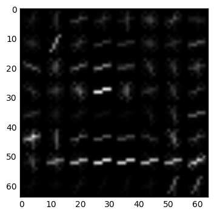

HOG on Channel 3:

As seen above, the information captured is limited, but to get more information, no. of pixels per cell needs to be reduced. This causes features to bloat up and eventually leads to memory errors during training when attempting to scale data.

####2. Explain how you settled on your final choice of HOG parameters.

Selecting between parameters is an optimization problem. Make parameters too aggressive and the vehicle is not detected in some frames. Make it too soft and one will have several false-positives. For this assignment, I went towards aggressive side and did detections at multiple sizes to ensure detectability. 

1. Color space: The observed training accuracy with YCrCb was highest, so I decided to use YCrCb after trying out RGB, HSV and HSL. 
2. Orientations: It was obvious that more orientations means more bins to classify in and more aggressive the HOG filter would be. After much experimentation, I decided to keep this at 9.
3. Pix-per-cell: I used 8 pixels per cell. As described above, lower number leads to memory errors.
4. Cells per block: Using block normalization can help prevent over-fitting, so it was kept at 2, but any higher would make the algorithm less aggressive.
5. HOG channels: I decided to use all channels to maximize the detection

####3. Describe how (and identify where in your code) you trained a classifier using your selected HOG features (and color features if you used them).

I trained a linear SVC in Part 6 of the notebook. The classifier was trained using spatial binning, color histogram and HOG features. The features were scaled to zero with unit variance before they were fitted into the model. At it stands, the model has over 99% accuracy when a random 20% was used to test model trained with rest 80% of the data.

###Sliding Window Search

####1. Describe how (and identify where in your code) you implemented a sliding window search.  How did you decide what scales to search and how much to overlap windows?

In Part 7.1, I define the detection area. I primarily use 3 detections based on their size and position. I decided these sizes based on the expected size of the car in the image.

1. The first detector is 64x64 pixels patches from Y=350 to Y=550. 

   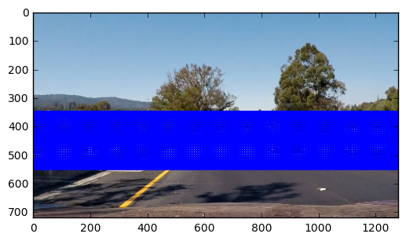

2. The second detector is 96x96 pixels patches from Y=375 to Y=600. 

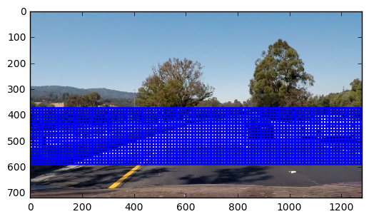

3. The third detector is 128x128 pixels patches from Y=400 to Y=650.

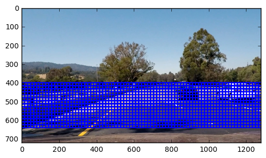

Each of this uses an overlap of 87.5% when moving to next cell. 

####2. Show some examples of test images to demonstrate how your pipeline is working.  What did you do to optimize the performance of your classifier?

Ultimately I searched on 3 scales using YCrCb 3-channel HOG features plus spatially binned color and histograms of color in the feature vector, which provided a nice result.  I combined the output at 3 resolutions and this resulted in the below output:

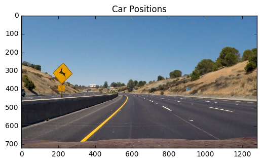

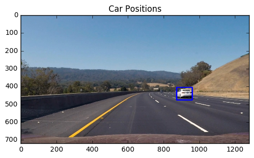

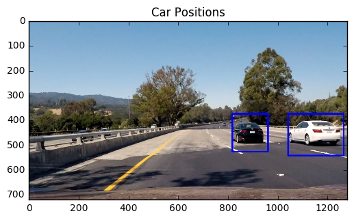

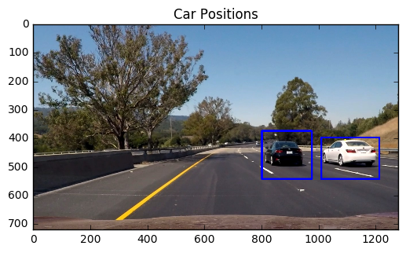

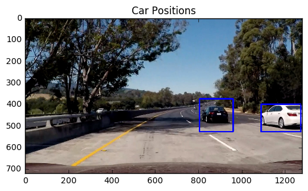

As shown above, the classifier works pretty well on images, since it was designed to be aggressive. I had a hard time classifying the third test image and eventually with 87.5% overlap, I was able to capture it well.

---

### Video Implementation

####1. Provide a link to your final video output.  Your pipeline should perform reasonably well on the entire project video (somewhat wobbly or unstable bounding boxes are ok as long as you are identifying the vehicles most of the time with minimal false positives.)
The video is in the ZIP file. I managed to identify the vehicles almost entire time with a good boundary around it, but the search windows also detects things on the left side, like oncoming cars. It does detect a couple of trees at the end, but that came at the expense of a good border around the cars.

####2. Describe how (and identify where in your code) you implemented some kind of filter for false positives and some method for combining overlapping bounding boxes.

To solve false positives, I used previous 2 images' vehicle positions and combined them into the heat map of the current image. This is because the vehicle is expected to be in the vicinity of its position in the previous frame. The heat map cools down after 3 frames, so old data is discarded accordingly. The heat map was then thresholded to identify vehicle positions.  I then used `scipy.ndimage.measurements.label()` to identify individual blobs in the heatmap.  I then assumed each blob corresponded to a vehicle.  I constructed bounding boxes to cover the area of each blob detected.  Below is the flow:

1. Calculate windows as stated above (above sliding window picture is the same image that is used here)
2. Calculate HOG features for the entire image. An example of HOG features is listed below:

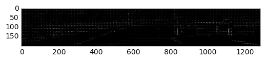

3. Search and predict for cars in sliding windows with spatial binning and color histogram matches along with extracted HOG features.
4. Add all detections and form a heat map based on the same. An example of this image is shown below:

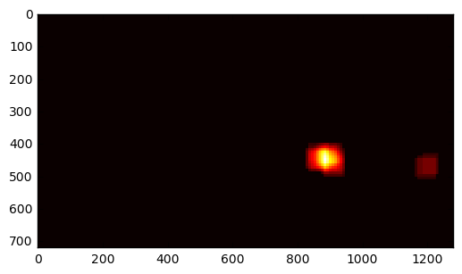

5. Combine past 2 detections into the heat map for video (car will be in the same vicinity as before) and threshold the heat map. 

6. Finally, label the heatmap into boxes and draw boxes around vehicle detections in the original image. Below is an example:

   

   ​

---

###Discussion

####1. Briefly discuss any problems / issues you faced in your implementation of this project.  Where will your pipeline likely fail?  What could you do to make it more robust?

The pipeline will probably fail in non-horizontal road where roads are curved upwards or downwards. It may also break in overexposed-bright and dark areas. The system will likely fail in real world, since the training data is not exhaustive enough and I haven't augmented it to make it more robust.

Issues: The system can detect the cars well, but it sometimes picks up the oncoming cars as well. It has some false detections at the end on the trees

Either there were too many false positives or just too many vehicle loss from frame. So I made the system aggressive and thus it is pretty computationally intensive now. The system would require serious computation power to run in real-time.